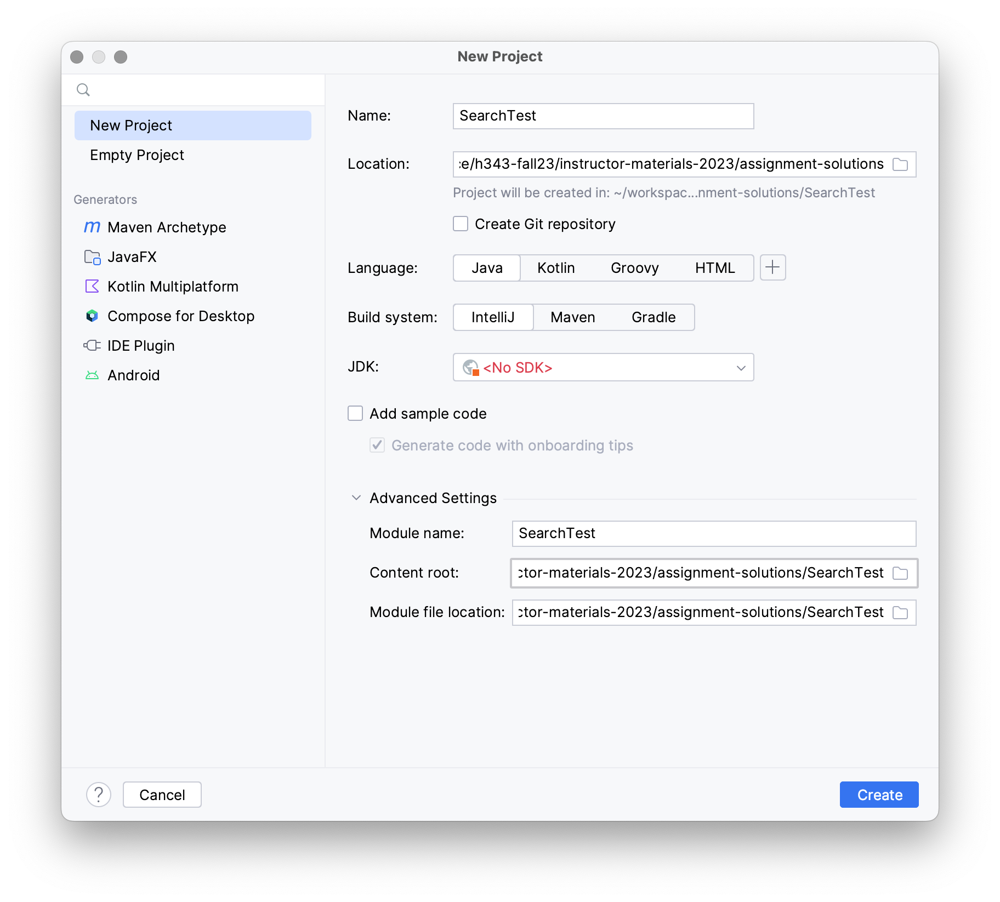
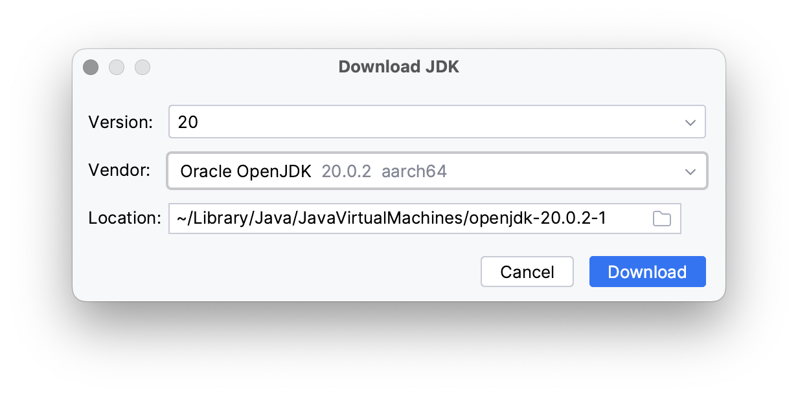
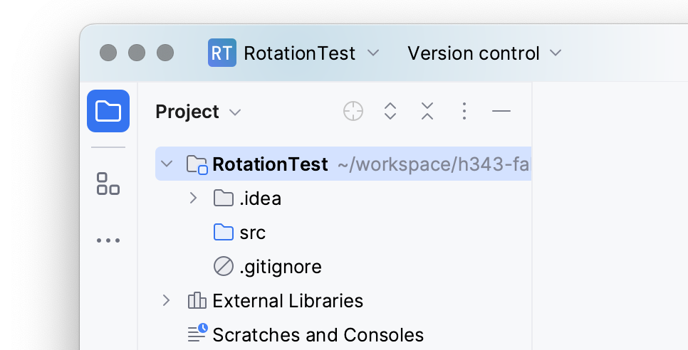
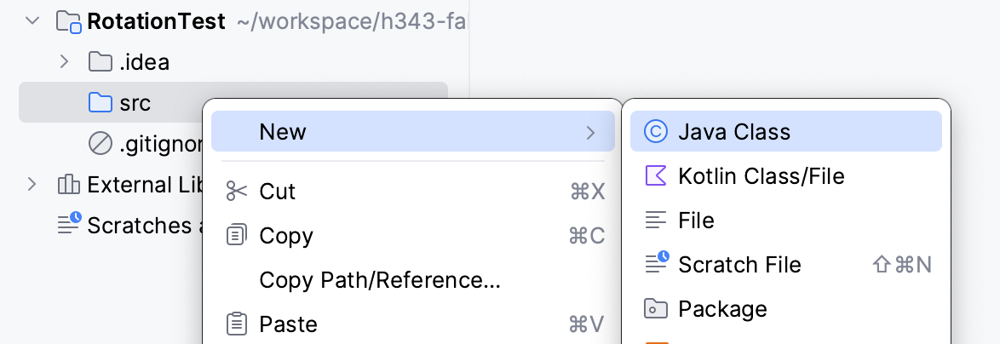
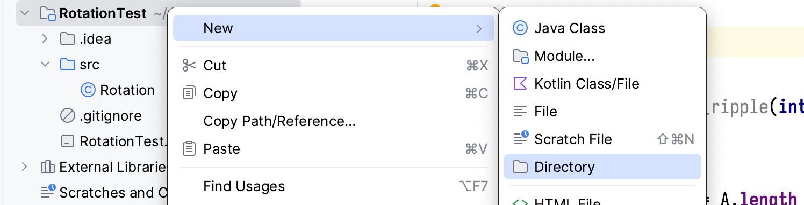
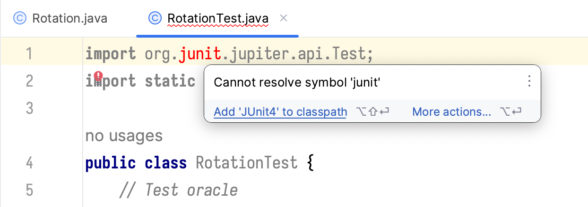
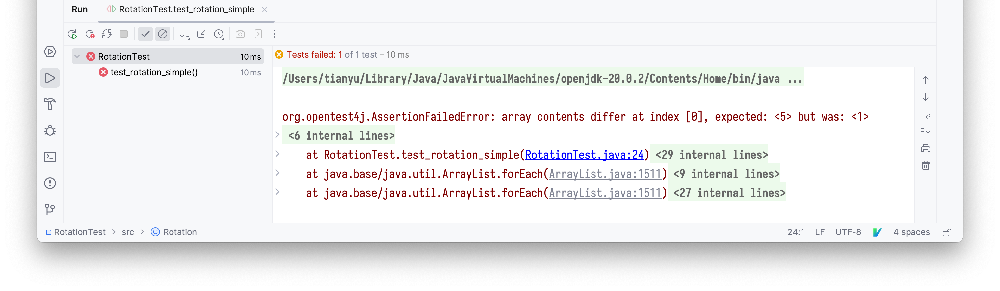
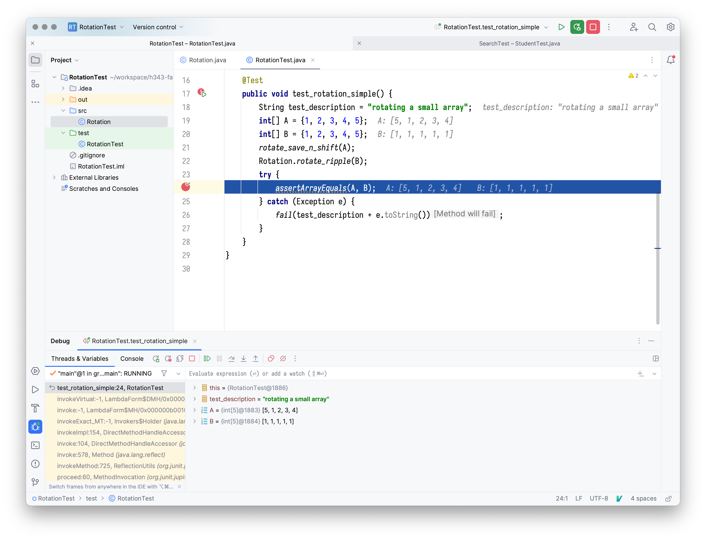

# Lab 1: Array Search Testing

## Table of contents

1. [Software installation and environment set-up](#software-installation-and-environment-set-up)
2. [Instructor demonstration: testing and debugging array rotation](#instructor-demonstration-testing-and-debugging-array-rotation)
3. [**Your assignment:** testing search algorithms](#your-assignment-testing-search-algorithms)

## Software installation and environment set-up

+ Download and install [IntelliJ IDEA](https://www.jetbrains.com/idea/download) Community Edition
  - Alternatively you can use a package manager such as Homebrew: `brew install intellij-idea-ce`
  - Software like IntelliJ is often referred to as
    [IDE](https://en.wikipedia.org/wiki/Integrated_development_environment)s, 
    because they integrate a code editor, build tools and a debugger.

+ Launch the IntelliJ IDE
  - In the welcome window, click "New Project". A new project should be created for each lab.
  - In the pop-up window, enter the title of your lab assignment as "Name".
    For lab 1, it should be `SearchTest` .
  - Choose "Location", which is whatever directory that you prefer to contain
    all lab assignments. Check "Create Git repository" if you would like to use
    version control (optional).
  - Language: "Java"; build systems: "IntelliJ"
  - Install JDK. Click "Add SDK -> Download JDK" in the "JDK" drop-down menu
    
  - In the pop-up window choose "Vendor" : "Oracle OpenJDK". "Version" should
    be filled in automatically (`20` as of the time of writing).
    Make sure version ≥15. "Location" can be left as default.
    
  - Click "Download" and wait for the download to finish. In the "New Project"
    window, uncheck "Add sample code" and leave everything else as is. Click "Create".

## Instructor demonstration: testing and debugging array rotation

In this section I will show you how to:

- Structure your lab projects
- Build and run the code
- Debug and test

You can download a copy of this demo [here](assets/RotationTest.tar.gz).

We first create a IntelliJ project "RotationTest". After creation, the file structure looks like:


Suppose we are to implement the "ripple" approach of array rotation. We right click on the
`src` directory in the file structure and choose **"Java Class"**.


We enter "Rotation" as its name. IntelliJ creates a new file `src/Rotation.java` whose
content is an empty `public class Rotation`. In the editor, we create `rotate_ripple`
as a public static member function of `Rotation`:

```java
public class Rotation {
    public static void rotate_ripple(int[] A) {
        if (A.length > 1) {
            int tmp1 = A[0];
            for (int i=0; i != A.length - 1; ++i) {
                int tmp2 = A[i+1];
                A[i+1] = tmp1;
                tmp1 = tmp2;
            }
            A[0] = tmp1;
        }
    }
}
```

Next we create unit tests for `rotate_ripple`. Right click on the root
directory and select "New -> Directory". Name the new directory `test`.


Right click on `test` in the file structure. Go to the last item in the pop-up menu
and select "Mark Directory As -> Test **Sources** Root". The `test` directory will be
highlighted in green.

Add a new Java class in `test` called `RotationTest`. Create `rotate_save_n_shift`
as a private static member function of `RotationTest`. We use `rotate_save_n_shift`
as our [test oracle](https://en.wikipedia.org/wiki/Test_oracle).

>  A test oracle is a mechanism for determining whether a test has passed or failed.

In this case, we are testing `rotate_ripple` against `rotate_save_n_shift`.

Next we import [JUnit](https://junit.org), a Java testing framework. Add the following
lines to the beginning of `RotationTest`:

```java
import org.junit.jupiter.api.Test;
import static org.junit.jupiter.api.Assertions.*;
```

Move cursor to `junit`, where IntelliJ tells me that it cannot resolve the symbol.
Click on "Add 'JUnit' to classpath" and then "OK". Perform the same action on `jupiter`.



Add the following as a public member function of `RotationTest`:

```java
@Test
public void test_rotation_simple() {
    String test_description = "rotating a small array";
    int[] A = {1, 2, 3, 4, 5};
    int[] B = {1, 2, 3, 4, 5};
    rotate_save_n_shift(A);
    Rotation.rotate_ripple(B);
    try {
        assertArrayEquals(A, B);
    } catch (Exception e) {
        fail(test_description + e.toString());
    }
}
```

Note that the function is marked with the `@Test` attribute, which indicates
that it contains a unit test.
The array `{1, 2, 3, 4, 5}` is the example that we talked about in lecture.
We call the two implementations of rotation and compare the produced arrays
using `assertArrayEquals`, which is wrapped in a try-catch block. Should the
assertion fail, the catch clause throws an exception, which contains an error
message that consists of description of the test case and the exception `e`.

We can run this test point by clicking on the green icon:


The rotation implementation is correct, so the test case passes:


We can also generate random numbers to fill the input array:

```java
@Test
public void test_rotation_random() {
    String test_description = "rotating an array with random integers";
    Random r = new Random(0);
    int[] A = new int[100];
    for (int i = 0; i != A.length; ++ i) {
        A[i] = r.nextInt();
    }
    int[] B = Arrays.copyOf(A, A.length);
    rotate_save_n_shift(A);
    Rotation.rotate_ripple(B);
    try {
        assertArrayEquals(A, B);
    } catch (Exception e) {
        fail(test_description + e.toString());
    }
}
```

Now that we have multiple test cases, we can select which tests to run
using the drop-down menu in the top-right corner:


Suppose I made a mistake in the implementation. For example, if I did not assign `tmp2`
to `tmp1`, it would cause the entire array to be filled with `A[0]` and produce a wrong
answer. If we remove `tmp1 = tmp2` and rerun the test, it catches the bug by throwing
an assertion error:



Now suppose we would like to debug the issue. We start by inspecting the two rotated arrays.
We can add a breakpoint at `assertArrayEquals(A, B)`. We click on the line number and
it turns into a red dot. Then we choose "Debug ..." from the drop-down menu:


Execution stops at the breakpoint. Both arrays, `A` and `B`, are displayed in the "Debug"
section of IntelliJ. We can see that the correct implementation produces `{5, 1, 2, 3, 4}` but
the buggy implementation produces `{1, 1, 1, 1, 1}` instead:



We can add more breakpoints by repeating the steps above. Breakpoints are controlled
using the "View Breakpoints" pop-up (the two-overlapping-red-circles button).
We can resume the execution by hitting the green play button ("Resume Program").
Alternatively, we can single-step through the program by pressing the down-arrow button.

## Your assignment: testing search algorithms

### Overview

Your tasks are to create test cases for three search algorithm implementations.
You have two options for test oracles: 1) using the Java standard library
2) implementing your own.

Think about the following questions before you start:

1. What does it mean for each search algorithm to be correct?
2. Can some of the three algorithms share the same test oracle? Why?
3. What are possible _corner cases_? Hint: arrays with 0 or 1 element, arrays
   with even or odd lengths, start and end positions being equal, ...

### Submission

**Testing locally**: create a class `Search` in `src/Search.java`,
which contains the search algorithms to test. Create your test oracles
as methods of `test/StudentTest.java`.

Submit your test file named `StudentTest.java`. The file should contain
`public class StudentTest`. The class contains a member function
`public void test()` (marked with `@Test`) which serves as the main entrance.

For example, if you have 2 test functions `test_foo()` and `test_bar()`,
the `test()` function should be:

```java
@Test
public void test() {
    test_foo();
    test_bar();
}
```

Inside each test function, use JUnit's
[assertions](https://junit.org/junit5/docs/5.0.1/api/org/junit/jupiter/api/Assertions.html)
such as `assertEquals` to check for the correct answer. Suppose you are testing
`Search.find_first_true(A, begin, end)` and the expected result is `2`:

```java
import org.junit.jupiter.api.Test;
import org.junit.jupiter.api.BeforeEach;
import static org.junit.jupiter.api.Assertions.*;

public class StudentTest {

    @Test
    public void test() {
        test_find_first_true();
    }

    @Test
    public void test_find_first_true() {
        // ...
        assertEquals(2, Search.find_first_true(A, begin, end));
    }
}
```

Autograder will run your submission on 8 problematic `Search` implementations.
It also runs one correct implementation to rule out false positive.
Your test cases are expected to throw exceptions on all implementations except the correct one.

### Problem Set

#### Problem 1: Testing Linear Search on an Array of Booleans

The most basic but surprisingly useful search function involves an
array `A` of boolean values (`true` or `false`). 

**Specification:** The `find_first_true(A, begin, end)` function
returns the position of the first `true` in array `A`, that is, find
the smallest index `i` such that `A[i]` is `true`.  The search is
restricted to the subarray within `A` that starts at the `begin` index
and finishes one element before the `end` index.  (This is called a
half-open interval.) If there are no `true` elements in the subarray,
then `find_first_true` returns the `end` position of the subarray. The
caller of `find_first_true` is required to provide a valid half-open
range, which means `begin <= end`, `0 <= begin`, `begin <= A.length`,
`0 <= end`, and `end <= A.length`.

**[Example 1]** If the input array `A` is

```java
{false, false, true, false, true}
```

then the result should be 2 because `A[2] == true` and there are no
`true` elements at lower indices (`A[0]` and `A[1]` are both `false`).

**[Example 2]** Suppose `A` is the array

```java
{true, false, true, false, true}
```

and we search in the half-open interval `[1,3)`. The answer should be `2`.

```java
find_first_true(A, 1, 3) == 2
```

The search function has the following signature:

```java
public static int find_first_true(boolean[] A, int begin, int end) {
    // ...
}
```

Add test cases for function `Search.find_first_true(A, begin, end)`
in the `StudentTest` class and call your tests in `test()`.

#### Problem 2: Testing Linear Search on an Array of Integers

Another search function involves an array of integers.

**Specification** The `find_first_equal(A, x)` function
returns the position of the first element in `A` that is equal to the `x` argument.
If there are no elements equal to `x`, the length of the array is returned.

**[Example 3]** Suppose `A` is the array

```java
{32, 11, 4, 5, 99, 5, 32, 75}
```
then the result of search for `5` should be `3`:

```java
find_first_equal(A, 5) == 3
```

The search function has the following signature:

``` java
public static int find_first_equal(int[] A, int x) {
    // ...
}
```

Add test cases for function `Search.find_first_equal(A, x)` in the `StudentTest`
class and call your tests in `test()`.
The implementation of `find_first_equal` could potentially depend on `find_first_true`.

#### Problem 3: Testing Binary Search on an Array of Booleans

We revisit searching an array of Booleans, but suppose that all of the
`false` elements in the array come before all of the `true` elements (sorted) this time.

**Specification:** The `find_first_true_sorted(A, begin, end)` returns
the position of the first `true` in array `A`, that is, it finds the
smallest index `i` greater or equal to `begin` and less than `end`
such that `A[i]` is `true`.  If there is no `true` within the
half-open range `[begin,end)`, it returns `end`.  The caller must supply a
valid half-open range which means `begin <= end`, `0 <= begin`, `begin <= A.length`,
`0 <= end`, and `end <= A.length`. Furthermore, the
array must already be sorted so that all the `false` elements come before any
`true` elements.

**[Example 4]** Suppose `A` is the sorted array

```java
{false, false, true, true, true, true, true}
```

The position of the first `true` element is `2` in this case.

The search function has the following signature:

```java
public static int find_first_true_sorted(boolean[] A, int begin, int end) {
    // ...
}
```

Add test cases for function `Search.find_first_true_sorted(A, begin, end)` 
in the `StudentTest` class and call your tests in `test()`.

-----------------

* You have reached the end of Lab 1. Yay!
