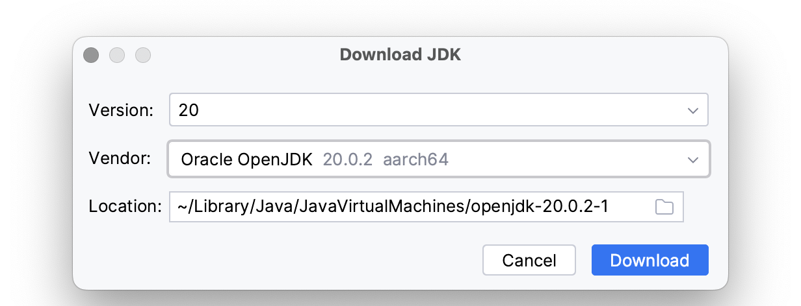
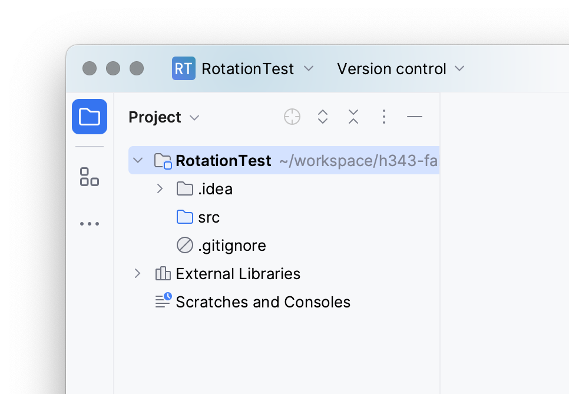
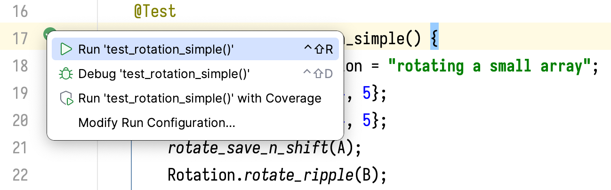
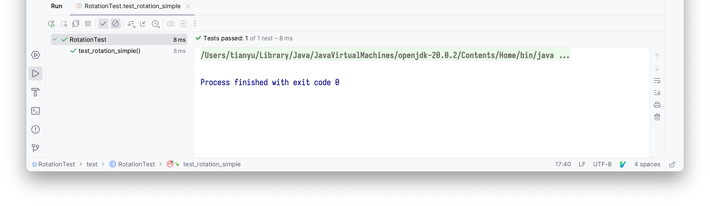

# Lab 1: Basics of Testing and Debugging

## Software installation and environment set-up

+ Download and install [IntelliJ IDEA](https://www.jetbrains.com/idea/download) Community Edition
  - Alternatively you can use a package manager such as Homebrew: `brew install intellij-idea-ce`
  - Software like IntelliJ is often referred to as
    [IDE](https://en.wikipedia.org/wiki/Integrated_development_environment)s, 
    because they integrate a code editor, build tools and a debugger.

+ Launch the IntelliJ IDE
  - In the welcome window, click "New Project". A new project should be created for each lab.
  - In the pop-up window, enter the title of your lab assignment as "Name".
    For lab 1, it should be `SearchTest` .
  - Choose "Location", which is whatever directory that you prefer to contain
    all lab assignments. Check "Create Git repository" if you would like to use
    version control (optional).
  - Language: "Java"; build systems: "IntelliJ"
  - Install JDK. Click "Add SDK -> Download JDK" in the "JDK" drop-down menu
    
  - In the pop-up window choose "Vendor" : "Oracle OpenJDK". "Version" should
    be filled in automatically (`20` as of the time of writing).
    Make sure version ≥15. "Location" can be left as default.
    
  - Click "Download" and wait for the download to finish. In the "New Project"
    window, uncheck "Add sample code" and leave everything else as is. Click "Create".

## Instructor demonstration: testing array rotation

In this section I will show you how to:

- Structure your lab projects
- Build and run the code
- Debug and test

I first create a IntelliJ project "RotationTest". After creation, the file structure is:


Suppose I am to implement the "ripple** approach of array rotation. I right click on the 
**`src`** directory in the file structure and choose **"Java Class"**.


I enter "Rotation" as its name. IntelliJ creates a new file `src/Rotation.java` whose
content is an empty `public class Rotation`. In the editor, I create `rotate_ripple` 
as a public static member function of `Rotation`:

```java
public class Rotation {
    public static void rotate_ripple(int[] A) {
        if (A.length > 1) {
            int tmp1 = A[0];
            for (int i=0; i != A.length - 1; ++i) {
                int tmp2 = A[i+1];
                A[i+1] = tmp1;
                tmp1 = tmp2;
            }
            A[0] = tmp1;
        }
    }
}
```

Next I am going to create unit tests for `rotate_ripple`. Right click on the root
directory and select "New -> Directory". Name the new directory `test`.


Right click on `test` in the file structure. Go to the last item in the pop-up menu
and select "Mark Directory As -> Test **Sources** Root". The `test` directory will be
highlighted in green.

Add a new Java class in `test` called `RotationTest`. Create `rotate_save_n_shift`
as a private static member function of `RotationTest`. We use `rotate_save_n_shift`
as our [test oracle](https://en.wikipedia.org/wiki/Test_oracle).

>  A test oracle is a mechanism for determining whether a test has passed or failed.

In this case, we are testing `rotate_ripple` against `rotate_save_n_shift`.

Next we import [JUnit](https://junit.org), a Java testing framework. Add the following
lines to the beginning of `RotationTest`:

```java
import org.junit.jupiter.api.Test;
import static org.junit.jupiter.api.Assertions.*;
```

Move cursor to `junit`, where IntelliJ tells me that it cannot resolve the symbol.
Click on "Add 'JUnit' to classpath" and then "OK". Perform the same action on `jupiter`.


Add the following as a public member function of `RotationTest`:

```java
    @Test
    public void test_rotation_simple() {
        String test_description = "rotating a small array";
        int[] A = {1, 2, 3, 4, 5};
        int[] B = {1, 2, 3, 4, 5};
        rotate_save_n_shift(A);
        Rotation.rotate_ripple(B);
        try {
            assertArrayEquals(A, B);
        } catch (Exception e) {
            fail(test_description + e.toString());
        }
    }
```

The array `{1, 2, 3, 4, 5}` is the example that we talked about in lecture.
I call the two implementations of rotation and compare the arrays afterwards
using `assertArrayEquals`, which is wrapped in a try-catch block. Should the
assertion fail, the catch clause throws an exception, which contains an error
message that consists of description of the test case and the exception `e`.

We can run this test point by clicking on the green icon:



The rotation implementation is correct, so the test case passes:



## Your assignment: testing search algorithms
