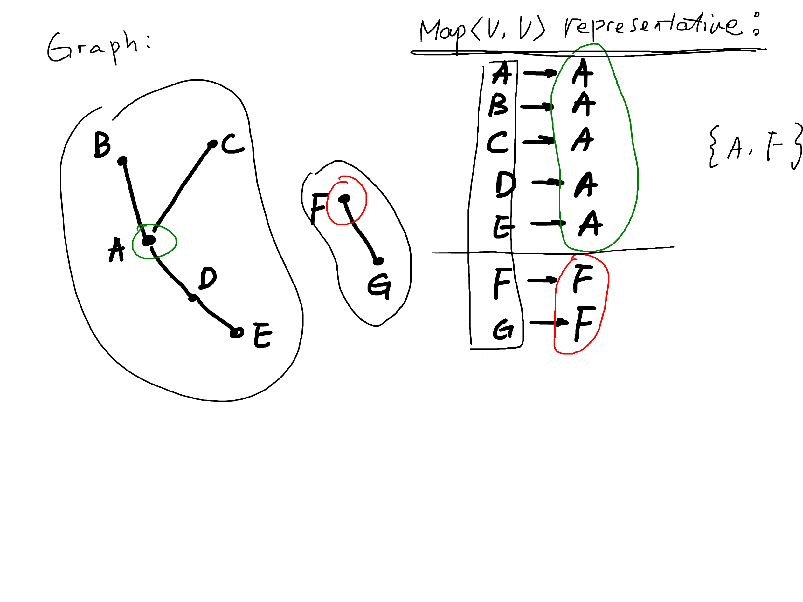

# Lab 7: Connected Components (DFS)

In an undirected graph, a *connected component* is a maximal
subset of vertices for which there is a path between every
pair of vertices in the set.
Finding connected components has become an important algorithm
in the realm of big-data graph analytics.

## Problem Description

Your task is to implement connected components using *depth-first search*.
In the `ConnectedComponents` class, implement the following method:

```java
public static <V> void
connected_components(Graph<V> G, Map<V,V> representative) {
    // your code
}
```

The output of the algorithm goes into the `representative` map.

The idea is that every vertex that is in a connected component
should be mapped to the same vertex in the component, which is
called the *representative* of the component. The representative
should be mapped to itself.

A correct implementation of `connected_components` should
provide a representative for every vertex in the graph.
Note that if a vertex is not connected to any other vertices,
it will end up being in a component all by itself, and it
will be the representative.

We recommend that you define one or more helper functions to
perform the depth-first search.

## Support Code and Submission

+ Student support code is at [link](https://github.com/IUDataStructuresCourse/connected-components-student-support-code).
  Please make sure to go through existing code before you start.
+ Submit your code file `ConnectedComponents.java` to
  [link](https://autograder.luddy.indiana.edu/web/project/702).
+ Submit your test file `StudentTest.java` to
  [link](https://autograder.luddy.indiana.edu/web/project/705).

## Example



-----------------

* You have reached the end of Lab 7. Yay!
