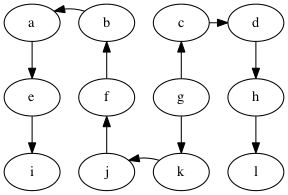
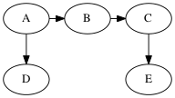
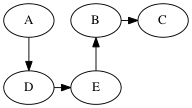
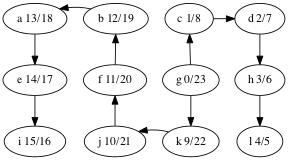
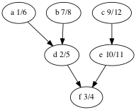

# Lecture: Depth-first Search

This search chooses to go deeper at each step, following an out-edge
from the current vertex to a never-before-seen vertex. If there are no
out-edges to never-before-seen vertices, then the search backtracks to
the last visited vertex with out-edges to never-before-seen vertices
and continues from there.

Show DFS on the following graph, starting at g:

Similar to BFS, DFS traverses a tree, a *depth-first tree*:

For generic search problems, that is, looking for a vertex with
a particular property, DFS and BFS both are good choices.

- BFS may require more storage if the graph has many high degree
  vertices because the queue gets big. 
- On the other hand, if the graph contains long paths, then DFS
  will use a lot of storage for it's stack.
- If there are infinitely long paths in the graph, then DFS
  may not be a good choice.

## Student group work

Perform DFS on the following graph

Solutions (there are multiple depth-first trees)

Are any of the DFS trees the same as a BFS tree for this graph?
Why not?

## Edge Categories

We can categorizes the edges of the graph with respect to the depth-first 
tree in the following way:
- tree edge: an edge on the tree, e.g., g → c in the graph above.
- back edge: an edge that connects a descendent to an ancestor
  with respect to the tree, e.g., f → g.
- forward edge: an edge that connects an ancestor to a descendent
  wrt. the tree, e.g., f → e
- cross edge: all other edges, e.g., k → l.

A graph has a cycle if and only if there is a back edge.

The DFS algorithm can compute the categories if we use a color
scheme to mark the vertices instead of just using a `done` flag.
The colors are:
- white: the vertex has not been discovered
- gray: the vertex has been discovered but some of its descendents
  have not yet been discovered
- black: the vertex and all of its descendents have been discovered

During DFS, when considering an out-edge of the current vertex, the edge
can be categorized as follows:
- the target vertex is white: this is a tree edge
- the target vertex is gray: this is a back edge
- the target vertex is black: this could either be a forward or cross edge

Do the DFS example again but with the white/gray/black colors.

## Discover and Finish Times

We can discover yet more structure of the graph if we record
timestamps on a vertex when it is discovered (turned from white to
gray) and when it is finished (turned from gray to black).

This is useful when constructing other algorithms that use DFS,
such as topological sort. Here are the discover/finish times
for the DFS tree we computed above, shown again below.

What's the relationship between topological ordering and depth-first
search?

Let's look at the depth-first forest and discover/finish
times of the makefile graph.

Here's the vertices ordered by finish time:
f,d,a,b,e,c.

That's the reverse of one of the topological orders:
c,e,b,a,d,f.

Why is that? A vertex is finished *after* every vertex that depends
on it is finished. That's the same as topological ordering
except we've swapped *before* for *after*.
