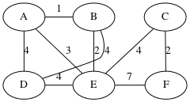
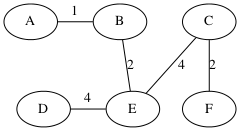
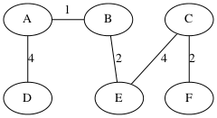
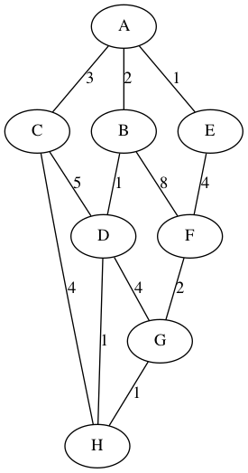
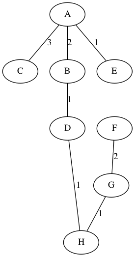

# Minimum Spanning Trees and Kruskal's Algorithm

Suppose you're a cable company and you are planning where to place
cables so that you reach every house, but you'd like to minimize the
amount of cable that you use.

**Definition.** A *spanning tree* is a subset of edges of a graph that form a
tree and that connect all the vertices in the graph.

**Definition.** Given an edge-weighted graph G, the *minimum spanning tree
problem* is to find a spanning tree of G whose total weight is less or
equal to any other spanning tree. We write T₁ ≤ T₂ when the total
weight of the edges in tree T₁ is less-than or equal to the
total weight of the edges in tree T₂.

There are two popular algorithms for MST, I'll cover
the first. The second is in the textbook.

* Kruskal's, resembles the union-find based connected components
* Prim's, resembles Dijkstra's algorithm (see textbook)

The two algorithms have a lot in common.

* They both maintain the following invariant at each step:
  they've identified a set of edges A that is a subset of
  one or more MSTs.
* At each step, they grow the set A by adding a *safe edge* (u,v)
  such that A ∪ {(u,v)} is a subset of one or more MSTs.

But how do we find a safe edge?

We'll need some definitions to lead up to the answer.

**Definitions**. Suppose G = (V,E) is a graph with weighted edges.

- A *cut* is a partition of the vertices into two groups.
  One can specify a cut with a set of vertices S. The other
  group is then V - S.
- An edge *crosses* the cut if one end is in one group and
  the other edge is in a different group. 
- An edge is a *light edge* if it crosses the cut and its weight is less
  or equal any other edge that crosses the cut.
- A cut *respects* a set A of edges if no edge in A crosses the cut.

The following theorem tells us that to find a safe edge, it suffices
to find a light edge.

**Theorem 23.1**
Let A be a subset of some MST of G=(V,E). Let (S,V-S) be a cut of G
that respects A. Let (u,v) be a light edge wrt. the cut. Then
(u,v) is a safe edge.

**Proof.**
Let T be a MST of G that includes A.

* Case (u,v) in T: Then trivially, A ∪ {(u,v)} ⊆ T.

* Case (u,v) not in T:

    We're going to construct another MST T' such that A ∪ {(u,v)} ⊆ T'.
    
    Because T is spanning, u and v are in T, so there
    is already a path from u to v in T. Thus, (u,v) completes a cycle.
	Recall the premise that (u,v) crosses the cut (S,V-S).
    A cycle with a crossing edge must have another crossing
    edge as shown in the following diagram.
    Let that other crossing edge be (x,y) . 

           u - - - x
           |       |
        ----------------- cut
           |       |
           v - - - y

    We form the new MST T' by removing (x,y) and adding (u,v):
    
    T' = T - {(x,y)} ∪ {(u,v)}
    
    Now we need to show that T' is an MST.
    We know that T' ≤ T because (u,v) is a light edge,
    so its weight is less-or-equal to that of (x,y). So T' is an MST.

    It remains to show that (u,v) is a safe edge, that is,
    
    A ∪ {(u,v)} ⊆ T - {(x,y)} ∪ {(u,v)}
    
    We had A ⊆ T, so we need to prove that (x,y) not in A,
    but we have that because the cut respects A.

**QED**

We can think of MST algorithms as maintaining a forest of trees, where
all the tree edges are in the set A. Initially, each vertex is in it's
own tree because A={}.  At each step, we merge two trees into a single
tree by identifying the lightest edge connecting them (such an edge is
safe).

## Kruskal's Algorithm

Main idea: process all the edges from lightest to heaviest

Demo of Kruskal's algorithm

	sorted list of edges:
	A-1-B, B-2-E, C-2-F, A-3-E, D-4-E, A-4-D, D-4-B, C-4-E, E-7-F

* Process A-1-B, union {A} and {B}:

			A--B  C

			D  E  F

* Process B-2-E, union {A,B} and {E}

			A--B  C
			   |
			D  E  F

* Process C-2-F, union {C} and {F}

			A--B  C
			   |  |
			D  E  F

* Process A-3-E, do nothing

* Process D-4-E, union {A,B,E} and {D}

			A--B  C
			   |  |
			D--E  F

* Process A-4-D, do nothing

* Process D-4-B, do nothing

* Process C-4-E, union {A,B,D,E} and {C,F} 

			A--B  C
			   | /|
			   |/ |
			D--E  F

### Implementation Ideas

* sort the edges by increasing weight to make it easy to
  process lighter edges before heavier edges.

* use union-find (aka DisjointSets) to keep track of the trees.
  Recall how DisjointSets works:
  
	 - We represent each partition as a tree whose 
	   root is the representative.
	 - The tree is stored just in terms of "parent" pointers.
	 - sets.make_set(x) sets the parent pointer of x to x.
	 - sets.find_set(x) walks up the parent pointers to the root.
	 - sets.union(x,y) sets the parent point of x to y (or vice versa).

### Implementation of Kruskal's algorithm in Java

    static <V> void kruskal_mst(EdgeGraph<V> G, 
                                Map<V,Map<V,Double>> weight,
                                ArrayList<Edge<V>> T, 
                                DisjointSets<V> sets)
    {
        for (V v : G.vertices())
            sets.make_set(v);
        ArrayList<Edge<V>> edges = new ArrayList<Edge<V>>();
        for (Edge<V> e : G.edges())
            edges.add(e);
        sort(edges, new CompareWeight<V>(weight));
        for (Edge<V> e : edges) 
            if (sets.find(e.source()) != sets.find(e.target())) {
                T.add(e);
                sets.union(e.source(), e.target());
            }
    }

### Time complexity
    
* initialize disjoint sets: O(n α(n))
* sort: O(m log m)
* main loop: O(m α(n))

The dominating cost is the sorting.
So the overall time complexity is O(m log m)
which can be instead stated as O(m log n)
because m < n² and therefore log m < 2 log n.

### Student group work

apply Kruskal's to the following graph (didn't get to this)

Solution: sorted edges: 

		   A-1-E, G-1-H, B-1-D, D-1-H
		   F-2-G, A-2-B, 
		   A-3-C,
		   E-4-F, C-4-H, D-4-G
		   C-5-D, 
		   B-8-F

An MST of weight 11: (there are other MST's)

