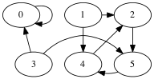
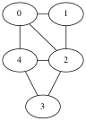
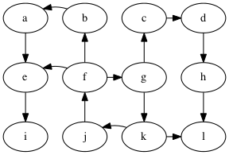
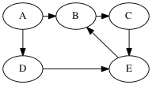
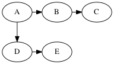

# Lecture: Graphs and Breadth-first Search

The standard mathematical way to represent a **graph** G is with a set
of vertices V and a set of edges E, that is, G = (V,E).

In a **directed graph**, each edge is a pair of vertices where the first
vertex is called the source and the second is the target.

In an **undirected graph**, each edge is a set containing two distinct
vertices.
    
I often use n for the number of vertices and m for the number of
edges.

The following is an example of a directed graph.

The set of vertices for this graph is 

    {0,1,2,3,4,5}.

The set of edges is 

    {(0,0), (1,2),(1,4),  (2,5),  (3,5),(3,0),  (4,2),  (5,4),  }.

The following is an undirected graph.

The set of vertices is `{0,1,2,3,4}`.

The set of edges is `{ {1,2},{1,0},  {2,3},{2,4},{2,0},  {3,4},  {4,0} }`.

We often writes an undirected edge as `(1,2)` or `1-2` instead of `{1,2}`.

## Adjacency List

The **Adjacency List** representation of a graph is an array of linked
lists.

Example: for the above directed graph the adjacency list
representation is

     |0| -> 0
     |1| -> 2 -> 4
     |2| -> 5
     |3| -> 0 -> 5
     |4| -> 2
     |5| -> 4

Example: for the above undirected graph the adjacency list
representation is

     |0| -> 1 -> 2 -> 4
     |1| -> 0 -> 2
     |2| -> 1 -> 4 -> 3 -> 0
     |3| -> 2 -> 4
     |4| -> 0 -> 3 -> 2

(Each edge is stored twice.)

Adjacency lists are good for storing sparse graphs.

* Space: O(n + m).
* Edge detection given two vertices: O(n)
* Edge insert: O(1)
* Edge removal given two vertices: O(n) 
* Edge remove given edge handle: O(1) if use double linked
* Edge removal: O(n) or O(1) if use double linked and edge handle
* Vertex insert: amortized O(1)
* Vertex delete: not easily supported

## Adjacency Matrix

The **Adjacency Matrix** representation of a graph is a Boolean matrix.

Example, for the directed graph above.

      0 1 2 3 4 5
    0 1 0 0 0 0 0
    1 0 0 1 0 1 0
    2 0 0 0 0 0 1
    3 1 0 0 0 0 1
    4 0 0 1 0 0 0
    5 0 0 0 0 1 0

Example, for the undirected graph above.

      0 1 2 3 4
    0 0 1 1 0 1
    1 1 0 1 0 0
    2 1 1 0 1 1
    3 0 0 1 0 1
    4 1 0 1 1 0

Note that the matrix is symmetric.

Adjacency matrices are good for dense graphs.

* Space: O(n²)
* Edge detection given two vertices: O(1)
* Edge insert: O(1)
* Edge removal given two vertices: O(1)
* Edge remove given edge handle: O(1)
* Edge removal: O(1)
* Vertex insert: amortized O(n)
* Vertex delete: not easily supported

How could we represent Adjacency Matrices in Java?

# Breadth-First Search

Def. a **path** is a sequence of edges such that the target of
each edge matches the source of the next edge in the sequence.
We sometimes abbreviate a path to v₀ ⇒ vₖ, where v₀ is the source
of the first edge and vₖ is the target of the last edge.
We write v₀ ⇒ᵏ vₖ when the length of the path is important.
Also, when talking about multiple different paths, we might
use a subscript to give the path a name, such as 
v₀) ⇒ₓ vₖ.

Problem: compute the shortest paths from vertex g to all other
vertices in the graph.

Example: what is a shortest path from g to f?

Possible solution: g → k → j → f, length 3.

To prove this is really the shortest, we need to make sure
there are no paths of length less-than 3 from g to f.

How do we prove that? Well, look at all paths of length less-than 3
that start from g.

Length 0 paths:

    g

Length 1 paths:

	g → c

	g → k

Length 2 paths:

	g → c → d

	g → k → l

	g → k → j

Good, none of the paths from g with length less-than 3 reach f.

So indeed, g → k → j → f is the shortest path from g to f.

## BFS Algorithm

Towards a general algorithm for BFS, can we compute all the k+1 length
shortests paths given all the k-length shortest paths?

Draw a picture of the wave-front of the k-length shortest paths and
the out-edges on the wave-front.

High-level Algorithm:

	for k = 0...n
	  for each path s ⇒ᵏ u:
		for each edge {u,v} incident to u:
		  If we don't already have a shortest-path to v, 
		  then s ⇒ᵏ⁺¹ u is a shortest path from s to v.

What data structures should we use?

* The shortest paths form a *tree*:
  for each vertex v, store the previous vertex u in its shortest path.
  we call u the "parent" of v because u is the parent of v in
  the tree of shortest paths. This is also called the 
  **breadth-first tree**.

* For the paths of length k:
  We just need the end vertex of each path, so let's maintain a bag
  of the vertices at the ends of the paths of length k.

* To make sure we ignore vertices that have already been encountered,
  we use an array called `done` that maps vertex numbers to True/False.

Version 1 of the algorithm

	static <V> void
    bfs_v1(Graph<V> G, V start, Map<V,Boolean> visited, Map<V,V> parent) {
		for (V v : G.vertices())
			visited.put(v, false);
		int k = 0;
		ArrayList<V> ends = new ArrayList<V>();
		ends.add(start);
		parent.put(start, start);
		visited.put(start, true);
		while (k != G.num_vertices()) {
			ArrayList<V> new_ends = new ArrayList<V>();
			for (V u : ends) 
				for (V v : G.adjacent(u))
					if (! visited.get(v)) {
						parent.put(v, u);
						new_ends.add(v);
						visited.put(v, true);
					}
			ends = new_ends;
			++k;
		}
	}

Some observations about version 1

* If the `new_ends` is empty at the end of the loop body,
  then we can stop early.

* The `ends` and `new_ends` can be combined into a single
  data structure if we use a queue instead of two bags.

	The front part of the queue represents `ends`
	and the back part of the queue represents `new_ends`.

	With this change, we can simplify the code by combining
	the `while k` and the `for u` loops into a single loop
	that checks whether the queue is non-empty.

Final version of breadth-first search 

	static <V> void
    bfs(Graph<V> G, V start, Map<V,Boolean> visited, Map<V,V> parent) {
		for (V v : G.vertices())
			visited.put(v, false);
		Queue<V> Q = new LinkedList<V>();
		Q.add(start);
		parent.put(start, start);
		visited.put(start, true);
		while (! Q.isEmpty()) {
			V u = Q.remove();
			for (V v : G.adjacent(u))
				if (! visited.get(v)) {
					parent.put(v, u);
					Q.add(v);
					visited.put(v, true);
				}
		}
	}

## Student group work

Example run of BFS version 2

	queue       parents
	[A]         P[A] = A
	[B,D]       P[B] = A, P[D] = A
	[D,C]       P[C] = B
	[C,E]       P[E] = D
	[E]
	[]

Time complexity of BFS

* Main loop: we traverse the entire adjacency list graph
  once and the combined length of the adjacency lists is O(m),
  so we have O(m) for the main loop. 
* Initialization: O(n) time and space for the parent and done arrays.
* Total: O(n + m)

