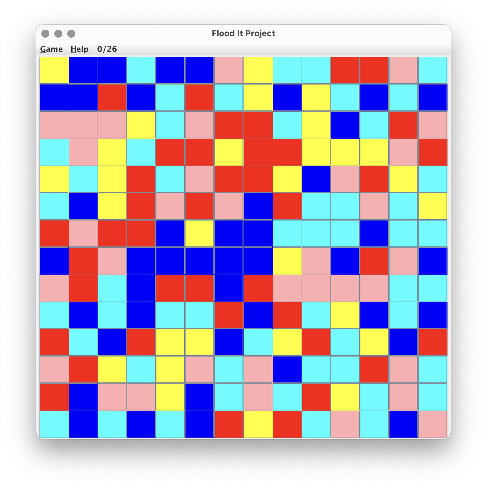
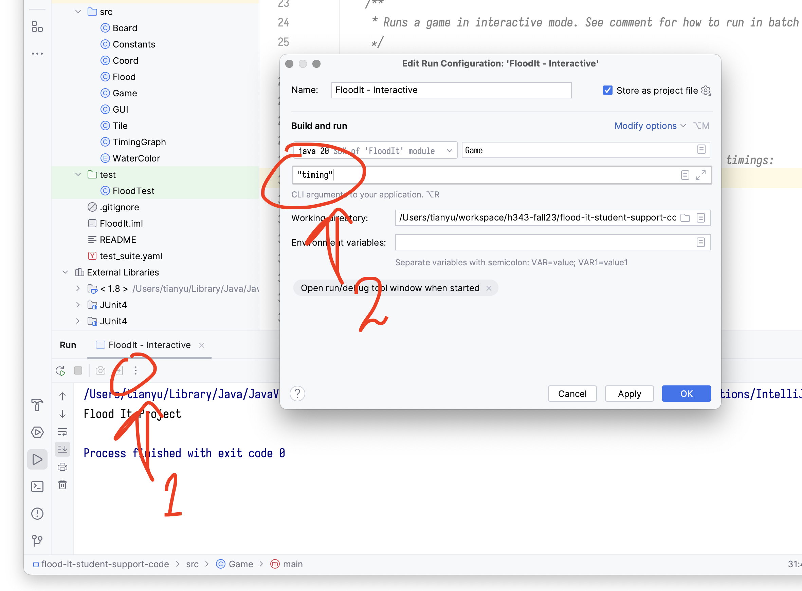

# Project 1: Flood It! 🌊

**[Note]** This is a group project. Students work in groups of 3 ~ 4 people.
  After completion, Every group member submits their solutions on Autograder <mark>individually</mark>.

## Table of Contents

1. [The Game](#software-installation-and-environment-set-up)
2. [Support Code and Submission](#support-code-and-submission)
3. [Specifications of `flood()`](#specifications-of-flood)
4. [**Problem Set**](#problem-set)

## The Game

“Flood It” is a tile coloring game played on a square board of colored tiles.

At each move, the player selects a color by clicking on one of the tiles.
The tile in the upper left corner, as well as all connected neighboring tiles of the same color,
are changed to the selected color. The objective of the game is end up with all the tiles
on the board being the same color while minimizing the number of moves.

If you haven’t played “Flood It” before, please spend some time playing the game
so that you can develop an intuition for how it works and formulate strategies
for game play before trying to implement anything. There is an [online version](http://unixpapa.com/floodit).

## Support Code and Submission

Don't worry! We have written most of the game
[here](https://github.com/IUDataStructuresCourse/flood-it-student-support-code).
The project has the following file structure:

```
.
├── FloodIt.iml
├── README
├── out
├── src
│   ├── Board.java
│   ├── Constants.java
│   ├── Coord.java
│   ├── Flood.java  (your code goes here)
│   ├── GUI.java
│   ├── Game.java
│   ├── Tile.java
│   ├── TimingGraph.java
│   └── WaterColor.java
├── test
│   └── FloodTest.java  (your tests goes here)
└── test_suite.yaml
```

Download ("Code (green button) -> Download ZIP") or clone the repository
and open it as an IntelliJ project. Run the `main()` function in `src/Game.java`
(use the green "Play" button next to that function or run the configuration "FloodIt - Interactive")
and you will see an interactive game window:



The game is not working properly at this moment, because the flooded region does not expand
when you click on a tile.
We need your help! Your task is to implement the `flood()` function in `src/Flood.java`.
Like prior labs, test your implementation locally by adding test cases in `test/FloodTest.java`.

After completion, submit **three** files to Autograder:
+ `Flood.java`: your code
+ `result.png`: the execution time graph in [Problem 3](#problem-3-comparing-time-complexity-between-implementations)
+ `README.md`: responses to Question 1 ~ Question 5.

⚠️**Do NOT submit your tests.** Autograder will test the correctness of your implementation using its own test suite.

## Specifications of `flood()`

We would like you to write the `flood()` function in `Flood` class.

### Input of `flood()`:

The `flood()` function takes four parameters:

+ `color : WaterColor`: The color that the player just selected. It is an instance of the `WaterColor` enum.

+ `flooded_list : LinkedList<Coord>`: a `LinkedList` of coordinates for all of the tiles in the current flooded region.
When a new game starts, `flooded_list` initially contains the region in the top left corner.

+ `tiles : Tile[][]`: a two dimensional array of `Tile`s, where `tiles[y][x]` accesses the tile
at the specified x and y coordinate. The x coordinate increase as you go to the right
and the y coordinate increase as you go down. The purpose of this parameter is to give you access
to the color of a tile, which can be obtained using the `getColor` method.

+ `board_size : Integer`: the number of rows of tiles in the board.
The number of columns is the same as the number of rows because the board is square.

### Output of `flood()`:

The `flood()` function modifies `flooded_list` by adding the newly flooded tiles.
Please note that you are not responsible for changing the color of any tiles.

**[Definition 1]** We say that a tile _neighbors_ another tile if it is directly above, below, left, or right,
that is, sharing a side with the other one.

The `Coord` class contains some helpful functions:

+ `up()`, `down()`, `left()`, and `right()`: compute the coordinates of neighboring tiles
+ `onBoard()`: tells you whether a coordinate is on the board
+ `neightbors()`: returns a list of neighboring coordinates

**[Definition 2]** An X-colored region is a set of tiles defined as follows:

+ A tile of color X is an X-colored region.
+ If tile T is color X and neighbors a tile in an X-colored region R,
  then the union of T and R is an X-colored region.

<!-- OLD: -->
<!-- Given a flooded_list whose tiles are of color X, the flood function should add every -->
<!-- X-colored region to the flooded_list, provided the region contains a tile that -->
<!-- is adjacent to a tile in the flooded_list. -->

Given a `flooded_list` and a player selected color X (parameter `color` in input),
the `flood()` function should add every X-colored region to the `flooded_list`,
provided that the region contains a tile that neighbors a tile in the `flooded_list`.

## Problem Set

### Problem 1: Implementing, Testing and Debugging `flood()`

Play the game online and observe the behavior of flooding.
Program `flood()` according to [the specifications](#specifications-of-flood).

Before submitting to Autograder, test your code locally by writing test cases in `src/FloodTest.java`.
We have included a simple test case in that file to get you started.

> [Development note] You may submit just `Flood.java` on Autograder to test the correctness of `flood()`.

### Problem 2: Plotting Execution Time and Analyzing Time Complexity

After ensuring the correctness of `flood()`, we consider its time efficiency.

Run the game in batch timing mode by adding `"timing"` to the program arguments
in the "Run: FloodIt - Interactive" configuration window:



This will display a graph of the execution time (along the y-axis)
versus the number of tiles on the board (along the x-axis) and it will
save the graph to PNG file named `result.png`.

> [Development note] If `flood1()` is empty, you may temporarily change the
> limit for loop variable `k` in `Game.batchTest()` to `k != 1`, so that only
> `flood()` is used for plotting.
> Remember to change `k` back in Problem 3.

> [Development note] If your code is so slow that no graph is produced when running in batch mode,
> try temporarily reducing the value of `MAX_BOARD_SIZE_FOR_AUTOPLAY` in `src/Constants.java`.
> For each board size, the game is repeated 5 times to reduce the effect of noise.
> Turning down the `NUM_GAMES_TO_AUTOPLAY` parameter may save you time during development.

Look at the graph. Answer the following questions in your project write-up:

+ **[Question 1]** What function roughly fits that graph?
  Hint: possibilities are $f(n) = n$, $f(n) = n^2$, $f(n) = n log(n)$...
+ **[Question 2]** What is the time complexity of your `flood()` function based on analyzing its code?
  Answer the question in your write-up and write the complexity as a line of comment in your code
  above the function.
+ **[Question 3]** Does your analysis match up with what you see in the graph?
  - If not, double check your analysis.
+ **[Question 4]** What data structures did you use (linked lists, arrays...) ?
  Is the time complexity of your flood function the best it can be or can you do better? Why?

### Problem 3: Comparing Time Complexity Between Implementations

Try to improve the time complexity of your flood function.

Write a new flood functions `flood1()`, whose execution time does not grow so quickly
as the number of tiles increases. When you run `flood1()` in batch mode, the timing for
the alternate implementation will show up as a gray line.

Swap the names so that your most time efficient implementation is named `flood()`,
so that it will be the version used interactively. Re-run with `"timing"` and produce a graph,
in which the line of the most efficient version is in red.

+ **[Question 5]** What is the time complexity of your alternative implementation?
  Comment the function with its time complexity in your code and write down the
  time complexity in your write-up.

### Last Step: Checking Your Submission

Make sure all three files were submitted: `Flood.java` (both `flood()` and `flood1()`), `result.png` and `README.md`.

-----------------

* You have finally reached the end of Project 1. Congratulations!
